# Database Entity Relationship Diagram (ERD)

## Whisper of Hope Database Schema

```mermaid
erDiagram
    users {
        bigint id PK
        string username UK
        string email UK
        string phone
        string password
        string profile_pic
        date dob
        enum role
        enum gender
        timestamp email_verified_at
        string remember_token
        timestamp created_at
        timestamp updated_at
    }

    colors {
        bigint id PK
        string name
        string hex_value
        string font_color
        timestamp created_at
        timestamp updated_at
    }

    categories {
        bigint id PK
        string name
        timestamp created_at
        timestamp updated_at
    }

    purposes {
        bigint id PK
        string name
        timestamp created_at
        timestamp updated_at
    }

    hair_donations {
        bigint id PK
        string full_name
        int age
        string email
        string phone
        int hair_length
        bigint user_id FK
        timestamp created_at
        timestamp updated_at
    }

    hair_requests {
        bigint id PK
        string recipient_full_name
        int recipient_age
        string recipient_email
        string recipient_phone
        text recipient_reason
        bigint user_id FK
        bigint purpose_id FK
        timestamp created_at
        timestamp updated_at
    }

    stories {
        uuid id PK
        string title
        string image
        longtext content
        bigint category_id FK
        timestamp created_at
        timestamp updated_at
    }

    whispers {
        uuid id PK
        string to
        text content
        bigint color_id FK
        timestamp created_at
        timestamp updated_at
    }

    sessions {
        string id PK
        bigint user_id FK
        string ip_address
        text user_agent
        longtext payload
        int last_activity
    }

    password_reset_tokens {
        string email PK
        string token
        timestamp created_at
    }

    cache {
        string key PK
        mediumtext value
        int expiration
    }

    cache_locks {
        string key PK
        string owner
        int expiration
    }

    jobs {
        bigint id PK
        string queue
        longtext payload
        tinyint attempts
        int reserved_at
        int available_at
        int created_at
    }

    job_batches {
        string id PK
        string name
        int total_jobs
        int pending_jobs
        int failed_jobs
        longtext failed_job_ids
        mediumtext options
        int cancelled_at
        int created_at
        int finished_at
    }

    failed_jobs {
        bigint id PK
        string uuid UK
        text connection
        text queue
        longtext payload
        longtext exception
        timestamp failed_at
    }

    %% Relationships
    users ||--o{ hair_donations : "creates"
    users ||--o{ hair_requests : "submits"
    users ||--o{ sessions : "has"
    
    categories ||--o{ stories : "categorizes"
    purposes ||--o{ hair_requests : "defines"
    colors ||--o{ whispers : "styles"
```

## Relationship Details

### Primary Relationships (Foreign Keys)

1. **users → hair_donations** (One-to-Many)
   - A user can create multiple hair donations
   - `hair_donations.user_id` references `users.id`
   - CASCADE DELETE: When a user is deleted, their hair donations are also deleted

2. **users → hair_requests** (One-to-Many)
   - A user can submit multiple hair requests
   - `hair_requests.user_id` references `users.id`
   - CASCADE DELETE: When a user is deleted, their hair requests are also deleted

3. **users → sessions** (One-to-Many)
   - A user can have multiple active sessions
   - `sessions.user_id` references `users.id`
   - No explicit cascade constraint (nullable)

4. **categories → stories** (One-to-Many)
   - A category can contain multiple stories
   - `stories.category_id` references `categories.id`
   - CASCADE DELETE: When a category is deleted, all stories in that category are deleted

5. **purposes → hair_requests** (One-to-Many)
   - A purpose can be associated with multiple hair requests
   - `hair_requests.purpose_id` references `purposes.id`
   - CASCADE DELETE: When a purpose is deleted, related hair requests are deleted

6. **colors → whispers** (One-to-Many)
   - A color can be used by multiple whispers
   - `whispers.color_id` references `colors.id`
   - CASCADE DELETE: When a color is deleted, whispers using that color are deleted

### Table Descriptions

- **users**: Core user authentication and profile information
- **hair_donations**: Records of hair donation submissions from users
- **hair_requests**: Requests for hair donations with specific purposes
- **stories**: Inspirational stories categorized by type
- **whispers**: Anonymous messages with color styling
- **colors**: Color palette for whispers styling
- **categories**: Classification system for stories
- **purposes**: Predefined reasons for hair requests
- **sessions**: User session management (Laravel framework)
- **password_reset_tokens**: Password reset functionality (Laravel framework)
- **cache/cache_locks**: Application caching system (Laravel framework)
- **jobs/job_batches/failed_jobs**: Queue system for background tasks (Laravel framework)

### Key Business Logic

1. **Hair Donation System**: Users can donate hair by filling out donation forms
2. **Hair Request System**: Users can request hair for specific purposes (medical, charity, etc.)
3. **Story Platform**: Categorized inspirational stories (likely related to hair donation experiences)
4. **Whisper System**: Anonymous messaging system with customizable colors
5. **User Management**: Full authentication system with role-based access (user/admin)
